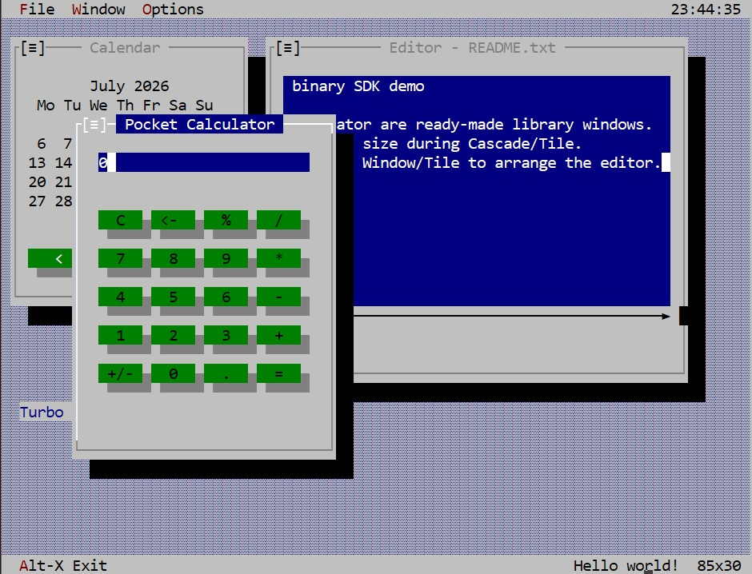

<!-- TurboVisionPB 0.16.8 | (C) CheshirCa 2026 -->

# TurboVisionPB Binary SDK

TurboVisionPB — библиотека текстового интерфейса для PureBasic 6.40 под
Windows 10/11 и Windows Server 2022. Public SDK содержит только бинарную DLL,
import library, публичный include, документацию и примеры. Исходный код
реализации не распространяется.

Поддерживаются PureBasic x64 и x86. Вызывающее приложение должно использовать
DLL той же архитектуры. `TurboVisionPB.dll` размещается рядом с готовым EXE.

Быстрый старт приведён в `SDK/Docs/GettingStarted.md`, полный контракт — в
`SDK/Docs/TV_programming_reference.md`, машинный каталог сигнатур — в
`SDK/Docs/API.md`. Исходники семи примеров находятся в `SDK/Examples`, а
готовые самодостаточные EXE — в `SDK/Examples/Bin/x64` и `x86`;
архитектурный ZIP содержит только соответствующий каталог. Многооконный
текстовый редактор демонстрирует Open/Save dialogs, Cascade/Tile, перемещение,
resize мышью и адаптивные `TextArea`.

Использование разрешено только в некоммерческих целях. Любое коммерческое
использование библиотеки или её части требует отдельного согласования с
CheshirCa. Полные условия находятся в `LICENSE.txt`.

Serial backend, COM-порты и ESP32 имеют статус «в разработке» и в этот выпуск
не входят. Другие ограничения: один поток, один активный backend, базовые
Unicode-символы одной ячейки и отсутствие drag-and-drop controls.

SDK также поддерживает постоянный статический текст на desktop и
нефокусируемые выпуклые/вдавленные рамки. Они показаны в
`SDK/Examples/Example02_Controls.pb` и описаны в
`SDK/Docs/DesktopDecorations.md`.

Classic desktop demo с готовыми Calendar/Calculator, часами и статическим
текстом status bar находится в `SDK/Examples/Example07_TurboVisionDemo.pb`.

Готовые EXE не импортируют `TurboVisionPB.dll` и запускаются без файлов из
остальных каталогов SDK. При самостоятельной компиляции открытых `.pb`
примеров используется обычная DLL-модель SDK.

TUI-примеры 01, 02, 03, 06 и 07 собраны как console-subsystem EXE. Поэтому при
запуске из Проводника Windows создаёт консольное окно, а cmd/PowerShell ожидают
завершения процесса. Примеры 04 и 05 остаются обычными GUI EXE.

Сообщения об ошибках и запросы коммерческого лицензирования:
<https://t.me/cheshircanest>.
